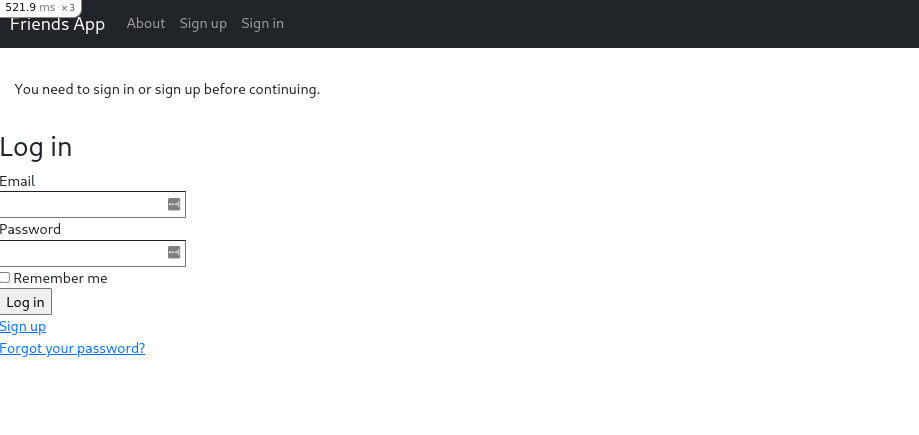
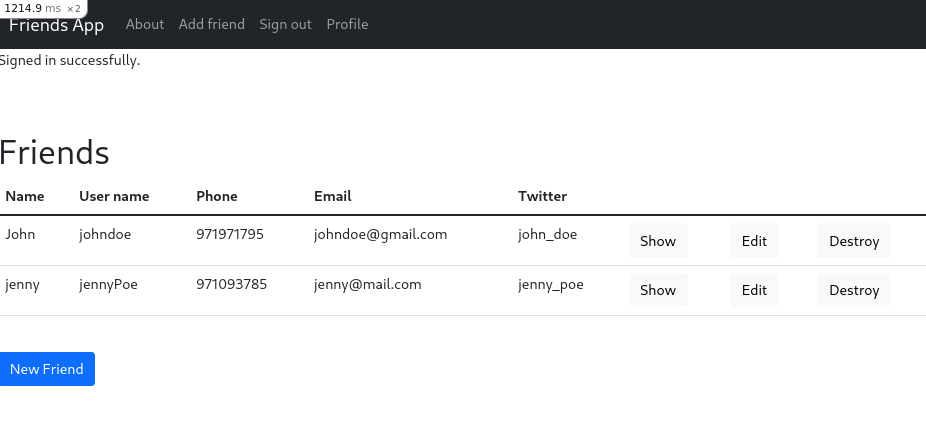

# 💛Rails Friends
Keep records of all your friends' relevant data with this minimal yet extremely secure rails app
## ⚙️Features
- Display your friends' emails, phone numbers and twitter profiles
- All your data is secured under your own and personal account 
- If the relationship is over then just destroy all data from that undesirable person 
## 🚀Build
Wanna run this app localy?
1. `rails db:drop db:create db:migrate`
2. `rails s`
## 👀Preview

